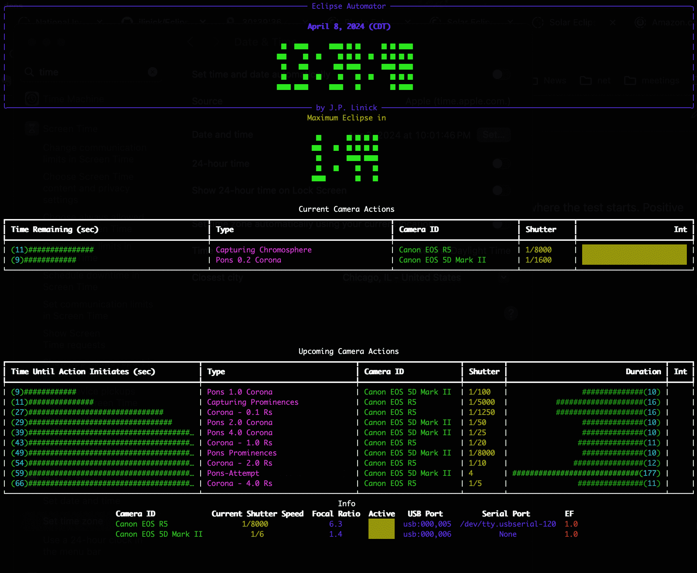

# Eclipse Automator

This script offers a lightweight and highly customizable solution for the automated orchestration of photography of total solar eclipses. It is designed to control an unlimited number of cameras through both USB and serial connections, and allows users to completely customize their imaging sequence. It provides optional customizable voice notifications, audio alerts and countdowns, alongside an optional terminal-based graphical user interface (GUI). It can determine appropriate of exposure times based on your equipment, and supports gps devices for automatic determination of eclipse timings.

This utility enables photographers to manage multiple cameras from a single computer, facilitating sophisticated imaging sequences to be run hands-free. Particularly, it supports serial connections, such as those used with Canon cameras, allowing for the capture of significantly more data during the critical period of totality. It also provides the ability to adjust global exposure durations in real-time via the up and down keypresses, allowing for immediate correction of any issues with under or overexposure.

A simple dashboard presents a overview of active cameras, along with a queue of impending camera actions timings, and eclipse phase countdown clock. Everything is orchestrated by a single JSON file. Moreover, running tests of your setup and the automation sequence is straightforward.

In summary, this script simplifies many of the technical complexities of eclipse photography, allowing photographers to capture sophisticated sequences with multile telescope/camera rigs and adjust things quickly and easily to run properly: hopefully enabling them to enjoy more of the eclipse itself.



## Requirements

This script is fully open-source and requires only gphoto2 and python libraries to run. (to install gphoto2: `sudo apt-get install gphoto2` or `brew install gphoto2`)

You will need a camera and a usb connection. Event audio notifcations currently probably only work on OSX, but it would be straightforward to port it to other platforms. An internet connection is helpful when updating eclipse timings and if you're observing location changes (like when trying to dodge clouds) a gps device will allow to skip putting in your location manually, but none of this is required to run the orchestration script.


## Installation


Clone and jump into the repository with

```
git clone https://github.com/jlinick/EclipseAutomator.git
cd EclipseAutomator
```

(Optionally) set up a virtual environment
```
python3 -m venv .eclipse
```

Install requisite python packages
```
python3 -m venv .eclipse
pip install -r requirements.txt
```
and you're good to go!

If you installed a virtual environment, you can exit with 
```
deactivate
```

and to load your virtual environment again
```
source .eclipse/bin/activate
```


## Running

For full customization of timings, cameras, and camera actions, see [below](#editing-info.json).

To test Eclipse Automator, plug in your camera and run
```
./run.py --test -95 --contact_time c2
```
This starts a test 95 seconds before totality. Simply change --test *NUM* to shift the start of the test *NUM* seconds relative to the given contact time. 


To run the script with or without gui/voice notifications/keyboard input
```
./run.py --nodisplay --nosound --noinput
```

Or change the input.json file to a different one
```
./run.py --input --test.json
```

On the day of the eclipse simply run
```
./run.py
```

For more information
```
./run.py --help
```


## Determining your Eclipse timings

In order to determine appropriate contact times, you will need to have a gps device, enter your location coordinates, or [enter the contact times manually](#contact_times-(optional)). This process will place the contact times in a jsonfile, and is done through the `determine_times.py` script. 

If you have a gps connected device you can run
```
./determine_times.py --auto
```
And the script will find your gps device, use that position data to query the US Naval Observatory for contact times, and then fill the jsonfile with those timings. 

You can also enter the date of a specific eclipse, as in
```
./determine_times.py --auto --date 2024-04-08
```

Alternatively, enter your location manually. An example for the 2024 Total Eclipse would be

```
./determine_times.py --lat 30.639372 --lon -98.409038 --height 258 --date 2024-04-08 --input info.json
```

This will query the US Naval Observatory API for the exact eclipse timings for the given location and fill out info.json. This does require an internet connection to run as it queries the US Naval Observatory. Alternatively, you can use an eclipse timing app and input the times directly into the json [(see contact_times below)](#contact_times-(optional)).

For more details

```
./determine_times.py --help
```


## Schema for info.json

The info jsonfile is structured into a 5 parts: contact_times, equipment, phases, voice_actions, and camera_actions. This is where you set all of the information necessary to run your custom orchestration. You can create several different jsonfiles, and run each with the --input filename.json in the run.py command.

### contact_times (optional)

If you didn't use the `determine_times.py` script and want to set eclipse timings manually, you can find timings from other sources such as [Photo Ephemeris](https://app.photoephemeris.com/) or the [Solar Eclipse Timer App](https://www.solareclipsetimer.com/), and enter them as shown below:

```
"contact_times":[
    {"name": "c1", "time": "2024-04-08T12:16:53.200000-05:00", "text": "First Contact"},
    {"name": "c2", "time": "2024-04-08T13:34:15.700000-05:00", "text": "Beginning of Totality"},
    {"name": "max","time": "2024-04-08T13:36:27-05:00", "text": "Maximum Eclipse"},
    {"name": "c3", "time": "2024-04-08T13:38:40.300000-05:00", "text": "End of Totality"},
    {"name": "c4", "time": "2024-04-08T14:57:25.800000-05:00", "text": "End of Eclipse"}
],
```
*Note that the automated actions are all based on these times, so ensure they are entered properly. If you enter them manually we recommend you use proper ISO formatting that includes the timezone (it is better to be explicit rather than implicit). If timezone is not included the timings will default to your currently set computer timezone on runtime.*

### equipment

This section is where you enter your camera info.
```
"equipment":[
    {"camera_id": "Canon EOS R5", "serial_port": "/dev/tty.usbserial-1130", "f_ratio": 6.3, "iso": 400, "enhancement_factor": 1.0},
    {"camera_id": "Canon EOS 5D Mark II", "f_ratio":1.4, "iso":400, "enhancement_factor": 1.0}
],
```

`camera_id` should uniquely identify your camera, if only one camera is used this is not necessary. We recommend you use the camera name specified by gphoto2 (you can check by running `./show_devices.sh`). This will allow the script to identify the usb port of your equipment automatically even with multiple cameras connected. Otherwise, if you change the port your camera is plugged into you will need to specify the correct port in usb_port below.

`usb_port` (optional) the usb port of the camera. This will show up under /dev/tty\*usb\* Keep in mind if you plug your camera into different ports this will change. Runing `./show_devices.sh` should show you your connected cameras and their specific usb ports.

`serial_port` required to control cameras via a serial port. run `./show_devices.sh` for a list of available serial devices.

`f_ratio` required only when using the script to calculate your exposure times.

`iso` required only when using the script to calculate your exposure times.


`enhancement_factor` recommended when you want one camera to calculate exposure times differently than another. (just a constant scalar. This can be adjusted on the fly with the up and down arrows on the keyboard)

### phases

Unless you decide to add or remove a new event above, you can leave this alone. It's only used to update the text graphic for the given phase.

```
"phases":[
    {"end": "c1", "text": "Pre-Eclipse"},
    {"start": "c1", "end": "c2", "text": "Partial"},
    {"start": "c2", "end": "c3", "text": "Totality"},
    {"start": "c3", "end": "c4", "text": "Partial"},
    {"start": "c4", "text": "Post-Eclipse"}
],
```

### voice_actions

Each voice action represents a specific audio notification given at a specific time. This is where you enter each voice action. Each action is referenced to a specific time (determined by the contact_times above.)

```
{"text": "First phase of the eclipse begins in 20 minutes.", "time": "c1", "offset": -1200, "voice": "Alex"},
```
`text` is the phrase that is spoken

`time` is the phase that is used as a time reference

`offset` (optional) the number of seconds the notification is offset from that contact_time. defaults to 0.

`voice` to use one of the different Apple Voices (there are many) you can include it here.

So to do a countdown to totality, you would add
```
{"text": "Totality in.", "time": "c2", "offset": -6},
{"text": "5.", "time": "c2", "offset": -5},
{"text": "4.", "time": "c2", "offset": -4},
{"text": "3.", "time": "c2", "offset": -3},
{"text": "2.", "time": "c2", "offset": -2},
{"text": "1.", "time": "c2", "offset": -1},
{"text": "Totality has begun!", "time": "c2"}
```

### camera_actions

These can be referenced in the same way as the above, for a single photograph at a specific time, but camera_actions also support photos taken every X intervals, or as many shots of a specific type as possible, over a given period.

`text` is the text shown on the GUI when the action is being run, or queued.

`shutter` is the given shutter speed for that action. The script will calculate shutter times for your equipment if a specific string is input here (see below).

`time`, `start` and `end` are used as a time reference for that contact_time (should be "c1","c2","max","c3","or c4")

`offset` `start_offset` and `end_offset` are used with `time` to offset (in seconds) relative to the given contact_time. it should be a negative or positive integer, negative for before the contact_time, and positive after. This controls when the action starts and ends.


A few examples: 

a single shot, taken 90 seconds before totality:
```
{"text": "Single shot", "shutter": "1/200", "time": "c2", "offset": -90}
```

a series of shots, taken every 20 seconds during the first partial phase:
```
{"text": "Partial Phase Shots", "shutter": "1/2000", "start": "c1", "end": "c2", "interval" 20}
```

a series of shots, taken every 20 seconds during the first partial phase, starting 95 seconds after c1 and ending 30 seconds before c2:
```
{"text": "Partial Phase Shots", "shutter": "1/2000", "start": "c1", "start_offset": 95, "end": "c2", "end_offset": -30, "interval" 20}
```

as many shots as possible, at 1/5000 shutter speed, during the 12 seconds up to c2:
```
{"text": "Baily's Beads", "shutter": "1/5000", "start": "c2", "start_offset": -12, "end": "c2"}
```

if multiple cameras are used, you must include a `camera_id` value for each camera action. So a really simple action of two cameras capturing all of totality with different shutter speeds could be:
```
{"text": "R5 Totality", "shutter": "1/5000", "start": "c2", "end": "c3","camera_id": "Canon EOS R5" },
{"text": "5d Totality", "shutter": "1/250", "start": "c2", "end": "c3", "camera_id": "Canon EOS 5d Mark IV"}
```

Additionally, if any of the strings below are inserted in the `shutter` field, eclipse times are calculated in accordance with [this NASA Exposure Guide](https://umbra.nascom.nasa.gov/eclipse/980226/tables/table_26.html):

```
'Partial, ND 4.0', 'Partial, ND 5.0', 'Baily\'s Beads', 'Chromosphere', 'Prominences', 'Corona - 0.1 Rs','Corona - 0.2 Rs', 'Corona - 0.5 Rs', 'Corona - 1.0 Rs', 'Corona - 2.0 Rs', 'Corona - 4.0 Rs', 'Corona - 8.0 Rs'
```

This all makes for a robust and powerful method for controlling multiple cameras. Here we include an example of a sequence that captures partial phases with a 30 second interval, captures Baily's Beads, brackets up through exposures, captures the Earthshine during max eclipse (when the moon is centered), brackets down through exposures and then captures Baily's beads, transitioning into a photo every 30 seconds during the partial phase.
```
"camera_actions":[
	{"text": "Partial Phase", "shutter": "1/200", "start": "c1", "end":"c2", "end_offset":-14, "interval": 30},
	{"text": "Capturing Baily's Beads", "shutter": "Baily's Beads", "start": "c2", "start_offset": -12, "end":"c2", "end_offset": 6},
	{"text": "Capturing Chromosphere", "shutter": "Chromosphere", "start":"c2", "start_offset":6, "end":"c2", "end_offset":16},
	{"text": "Capturing Prominences", "shutter": "Prominences", "start":"c2", "start_offset":16, "end":"c2", "end_offset":26},
	{"text": "Corona - 0.1 Rs", "shutter": "Corona - 0.1 Rs", "start":"c2", "start_offset":26, "end":"c2", "end_offset":36},
	{"text": "Corona - 0.5 Rs", "shutter": "Corona - 0.5 Rs", "start":"c2", "start_offset":36, "end":"c2", "end_offset":46},
	{"text": "Corona - 1.0 Rs", "shutter": "Corona - 1.0 Rs", "start":"c2", "start_offset":46, "end":"c2", "end_offset":56},
	{"text": "Corona - 2.0 Rs", "shutter": "Corona - 2.0 Rs", "start":"c2", "start_offset":56, "end":"c2", "end_offset":66},
	{"text": "Corona - 4.0 Rs", "shutter": "Corona - 4.0 Rs", "start":"c2", "start_offset":66, "end":"c2", "end_offset":76},
	{"text": "Corona - 8.0 Rs", "shutter": "Corona - 8.0 Rs", "start":"c2", "start_offset":76, "end":"c2", "end_offset":86},
	{"text": "Corona - 0.1 Rs", "shutter": "Corona - 0.1 Rs", "start":"c2", "start_offset":86, "end":"max", "end_offset":-16},
	{"text": "Earthshine", "shutter":"8", "start":"max", "start_offset":-16, "end":"max", "end_offset":16},
	{"text": "Corona - 8.0 Rs", "shutter": "Corona - 8.0 Rs", "start":"max", "start_offset":16, "end":"max", "end_offset":26},
	{"text": "Corona - 4.0 Rs", "shutter": "Corona - 4.0 Rs", "start":"max", "start_offset":26, "end":"max", "end_offset":36},	
	{"text": "Corona - 2.0 Rs", "shutter": "Corona - 2.0 Rs", "start":"max", "start_offset":36, "end":"max", "end_offset":46},
	{"text": "Corona - 1.0 Rs", "shutter": "Corona - 1.0 Rs", "start":"max", "start_offset":46, "end":"max", "end_offset":56},
	{"text": "Corona - 0.5 Rs", "shutter": "Corona - 0.5 Rs", "start":"max", "start_offset":56, "end":"max", "end_offset":66},
	{"text": "Corona - 0.1 Rs", "shutter": "Corona - 0.1 Rs", "start":"max", "start_offset":66, "end":"max", "end_offset":76},
	{"text": "Capturing Prominences", "shutter": "Prominences", "start":"max", "start_offset":76, "end":"max", "end_offset":86},
	{"text": "Capturing Chromosphere", "shutter": "Chromosphere", "start":"max", "start_offset":86, "end":"c3", "end_offset":0},
	{"text": "Capturing Baily's Beads", "shutter": "Baily's Beads", "start": "c3", "end_offset": 0, "end":"c3", "end_offset": 12},
	{"text": "Partial Phase", "shutter": "1/200", "start": "c3", "end": "c4", "start_offset": 14, "interval":30}
]
```

an example json is included as info.json.

When you are finished editing your jsonfile, run the program with 

```
./run.py --input your_json_file_path
```


## Troubleshooting


Note that many cameras will go to sleep if connected to a usb port without activity for a set period of time, and when that happens the camera will not show up as a connected device. So before running your script, either reset the camera or press the shutter to wake the camera. If the camera is left connected but not used for some time (like during the partial phase), it may go to sleep and not recognize usb commands (so we recommend keeping it on an interval). A serial cable connection should wake the camera in these situations. Currently we recommend you run `show_devices.sh` before you start your script, to make sure usb cameras are connected. Note that if you leave some image editing programs running (like Adobe Lightroom/Photoshop), they will block use of these usb devices, so we recommend closing these programs before use.

Currently the script does not validate the jsonfile. So a typo there will likely cause the script not to run properly. Make sure your json is correct and formatted properly! We recommend you test test test beforehand!

Running the script will generate logfile.log which you should inspect if you run into any issues.


## Miscellaneous

Future work includes the ability to referece camera actions into sequences, and then run specific sequences in whatever order you prefer. Also expand to Windows platforms and provide a Docker imaage.

For serial cable connections we've had success with [Hap Griffin Astrocables](https://imaginginfinity.com/astrocables.htm), or [make your own!](https://www.covingtoninnovations.com/dslr/canonrelease40d.html).


## Authors

- [@jlinick](https://www.github.com/jlinick)

